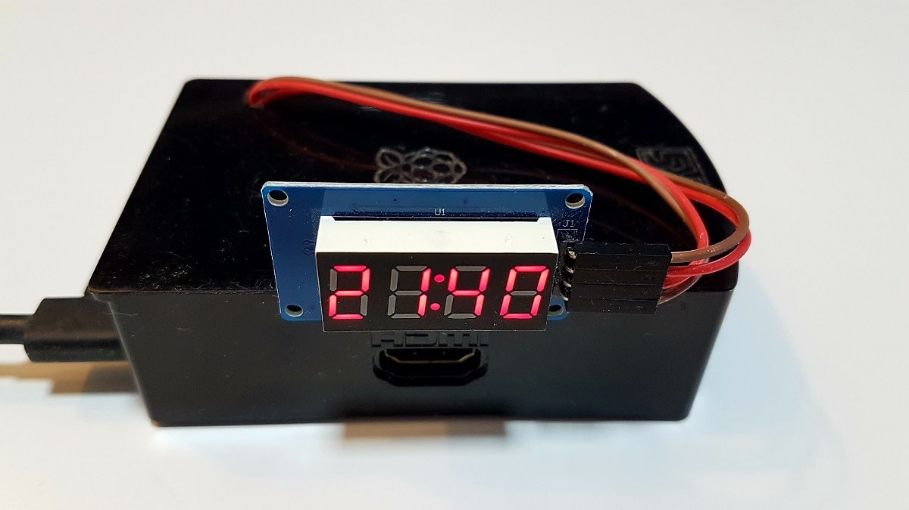

# TM1637
# Raspberry Pi Python 3 TM1637

A Python 3 port from MicroPython library for the quad 7-segment LED display modules based on the TM1637 LED driver, implemented on Raspberry Pi.

For example, the [Grove - 4 Digit Display module](http://wiki.seeed.cc/Grove-4-Digit_Display/)



They are called 7-segment displays as there are 7 LEDs for each digit (segment).
One byte (7 lower bits) for each segment. The 8th bit (MSB) is for the colon and only on the 2nd segment.

```
      A
     ---
  F |   | B   *
     -G-      H (on 2nd segment)
  E |   | C   *
     ---
      D

  HGFEDCBA
0b01101101 = 0x6D = 109 = show "5"
```

Display | Bin        | Hex  | Dec
------- | ---------- | ---- | ---
0       | 0b00111111 | 0x3F | 63
1       | 0b00000110 | 0x06 | 6
2       | 0b01011011 | 0x5B | 91
3       | 0b01001111 | 0x4F | 79
4       | 0b01100110 | 0x66 | 102
5       | 0b01101101 | 0x6D | 109
6       | 0b01111101 | 0x7D | 125
7       | 0b00000111 | 0x07 | 7
8       | 0b01111111 | 0x7F | 127
9       | 0b01101111 | 0x6F | 111
A       | 0b01110111 | 0x77 | 119
b       | 0b01111100 | 0x7C | 124
C       | 0b00111001 | 0x39 | 57
d       | 0b01011110 | 0x5E | 94
E       | 0b01111001 | 0x79 | 121
F       | 0b01110001 | 0x71 | 113
blank   | 0b00000000 | 0x00 | 0
\-      | 0b01000000 | 0x40 | 64
\*      | 0b01100011 | 0x63 | 99
