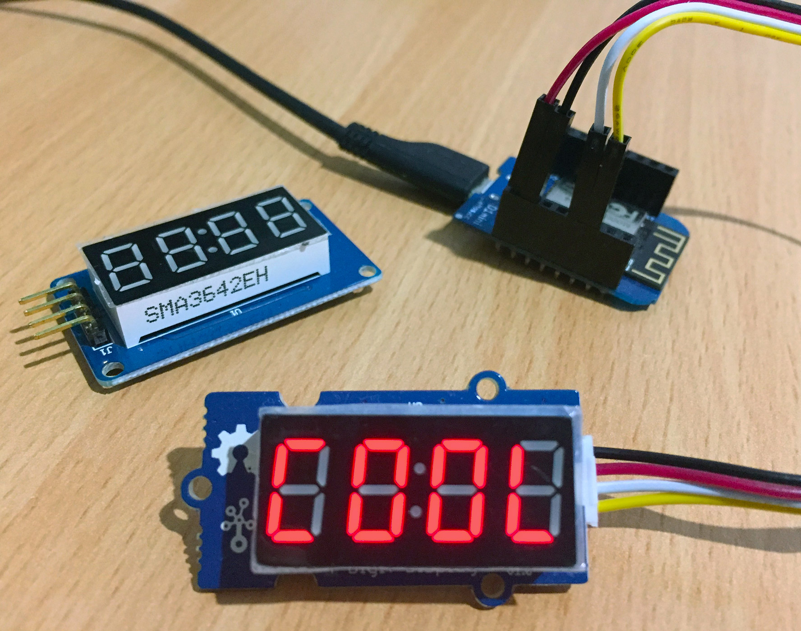

# MicroPython TM1637

A MicroPython library for quad 7-segment LED display modules using the TM1637 LED driver.

For example, the [Grove - 4 Digit Display module](http://wiki.seeed.cc/Grove-4-Digit_Display/)



## Examples

Copy the file to your device, using ampy, webrepl or compiling and deploying. eg.

```
$ ampy put tm1637.py
```

**Basic usage**

```python
import tm1637
from machine import Pin
tm = tm1637.TM1637(clk=Pin(5), dio=Pin(4))

# all LEDS on "88:88"
tm.write([127, 255, 127, 127])

# all LEDS off
tm.write([0, 0, 0, 0])

# show "0123"
tm.write([63, 6, 91, 79])

# show "COOL"
tm.write([0b00111001, 0b00111111, 0b00111111, 0b00111000])

# show "HELP"
tm.show('help')

# display "dEAd", "bEEF"
tm.hex(0xdead)
tm.hex(0xbeef)

# show "12:59"
tm.numbers(12, 59)

# show "-123"
tm.number(-123)

# show temperature '24*C'
tm.temperature(24)
```

For more detailed examples, see [tm1637_test.py](tm1637_test.py)

# Seven Segment Font

They are called 7-segment displays as there are 7 LEDs for each digit (segment).
One byte (7 lower bits) for each segment. The 8th bit (MSB) is for the colon and only on the 2nd segment.

```
      A
     ---
  F |   | B   *
     -G-      H (on 2nd segment)
  E |   | C   *
     ---
      D

  HGFEDCBA
0b01101101 = 0x6D = 109 = show "5"
```

Display | Bin        | Hex  | Dec
------- | ---------- | ---- | ---
0       | 0b00111111 | 0x3F | 63
1       | 0b00000110 | 0x06 | 6
2       | 0b01011011 | 0x5B | 91
3       | 0b01001111 | 0x4F | 79
4       | 0b01100110 | 0x66 | 102
5       | 0b01101101 | 0x6D | 109
6       | 0b01111101 | 0x7D | 125
7       | 0b00000111 | 0x07 | 7
8       | 0b01111111 | 0x7F | 127
9       | 0b01101111 | 0x6F | 111
A       | 0b01110111 | 0x77 | 119
b       | 0b01111100 | 0x7C | 124
C       | 0b00111001 | 0x39 | 57
d       | 0b01011110 | 0x5E | 94
E       | 0b01111001 | 0x79 | 121
F       | 0b01110001 | 0x71 | 113
G       | 0b00111101 | 0x3D | 61
H       | 0b01110110 | 0x76 | 118
I       | 0b00000110 | 0x06 | 6
J       | 0b00011110 | 0x1E | 30
K       | 0b01110110 | 0x76 | 118
L       | 0b00111000 | 0x38 | 56
M       | 0b01010101 | 0x55 | 85
n       | 0b01010100 | 0x54 | 84
O       | 0b00111111 | 0x3F | 63
P       | 0b01110011 | 0x73 | 115
q       | 0b01100111 | 0x67 | 103
r       | 0b01010000 | 0x50 | 80
S       | 0b01101101 | 0x6D | 109
t       | 0b01111000 | 0x78 | 120
U       | 0b00111110 | 0x3E | 62
v       | 0b00011100 | 0x1C | 28
W       | 0b00101010 | 0x2A | 42
X       | 0b01110110 | 0x76 | 118
y       | 0b01101110 | 0x6E | 110
Z       | 0b01011011 | 0x5B | 91
blank   | 0b00000000 | 0x00 | 0
\-      | 0b01000000 | 0x40 | 64
\*      | 0b01100011 | 0x63 | 99

# Methods

Get or set brightness.
```python
brightness(val=None)
```

Write one or more segments at a given offset.
```python
write(segments, pos=0)
```

Convert a single hex digit (0x00-0x0f) to a segment.
```python
encode_digit(digit)
```

Convert a string to a list of segments.
```python
encode_string(string)
```

Convert a single character to a segment.
```python
encode_char(char)
```

Display a number in hexadecimal format 0000 through FFFF.
```python
hex(val)
```

Display a number -999 through 9999, right aligned.
```python
number(num)
```

Display 2 independent numbers on either side of the (optional) colon, with leading zeros.
```python
numbers(num1, num2, colon=True)
```

Display a temperature -9 through 99 followed by degrees C.
```python
temperature(num)
```

Show a string on the display.
Shorthand for write(encode_string()).
Limited to first 4 characters.
```python
show(string, colon=False)
```

Display a string on the display, scrolling from the right to left, speed adjustable.
String starts off-screen and scrolls until off-screen at 4 FPS by default.
```python
scroll(string, delay=250)
```

## Parts

* [WeMos D1 Mini](https://www.aliexpress.com/store/product/D1-mini-Mini-NodeMcu-4M-bytes-Lua-WIFI-Internet-of-Things-development-board-based-ESP8266/1331105_32529101036.html) $4.00 USD
* [Grove 4 Digit Display](https://www.seeedstudio.com/grove-4digital-display-p-1198.html) $5.90 USD
* [Grove Male Jumper Cable](https://www.seeedstudio.com/Grove-4-pin-Male-Jumper-to-Grove-4-pin-Conversion-Cable-%285-PCs-per-Pack%29-p-1565.html) $2.90 USD

## Connections

WeMos D1 Mini | 4 Digit Display
------------- | ---------------
D1 (GPIO5)    | CLK
D2 (GPIO4)    | DIO
3V3 (or 5V)   | VCC
G             | GND

## Links

* [WeMos D1 Mini](https://wiki.wemos.cc/products:d1:d1_mini)
* [micropython.org](http://micropython.org)
* [TM1637 datasheet](http://www.titanmec.com/index.php/en/project/download/id/302.html)
* [Titan Micro TM1637 product page](http://www.titanmec.com/index.php/en/project/view/id/302.html)
* [Nokia 5110 version](https://github.com/mcauser/MicroPython-ESP8266-Nokia-5110-Quad-7-segment)
* [BBC micro:bit version](https://github.com/mcauser/microbit-tm1637)
* [Adafruit Ampy](https://learn.adafruit.com/micropython-basics-load-files-and-run-code/install-ampy)
* [micropython-tm1637 on pypi](https://pypi.python.org/pypi/micropython-tm1637/)

## License

Licensed under the [MIT License](http://opensource.org/licenses/MIT).
